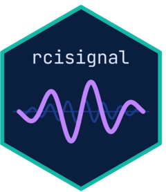
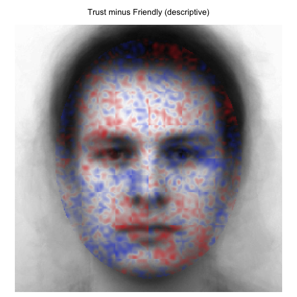
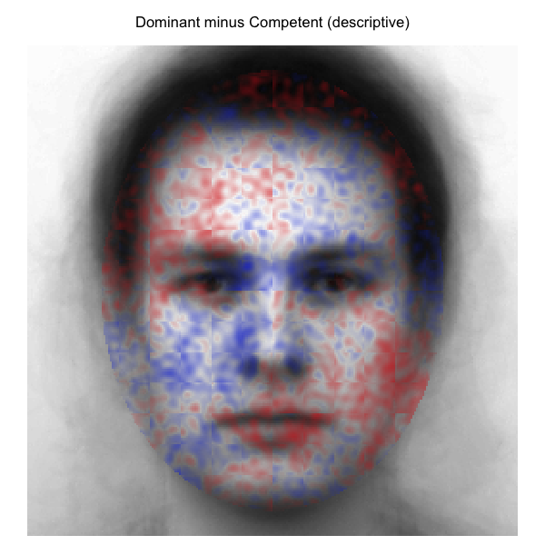
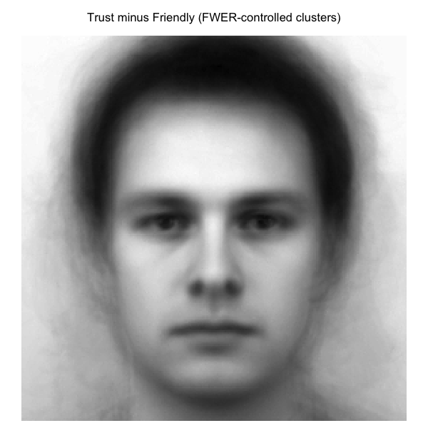
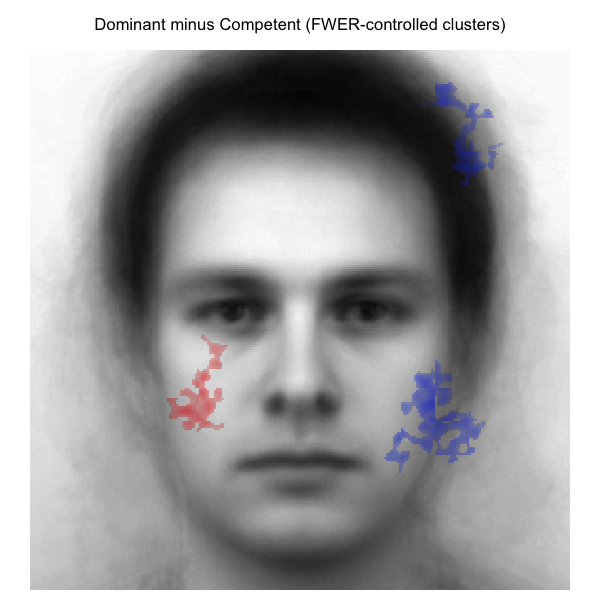

<!-- README.md (rendered at https://olivethree.github.io/rcisignal/) -->

# rcisignal 

A toolkit for quality assessment of reverse correlation
(RC) experiments end-to-end. Catches silent data-processing errors
*before* classification image (CI) computation, then quantifies CI
quality *after*: magnitude, stability, and discriminability.

<br clear="left"/>

<!-- badges: start -->
[](https://doi.org/10.5281/zenodo.19961180)
[](https://github.com/olivethree/rcisignal/actions/workflows/R-CMD-check.yaml)
[](https://olivethree.github.io/rcisignal/)
[](https://lifecycle.r-lib.org/articles/stages.html#experimental)
[](https://opensource.org/licenses/MIT)


<!-- badges: end -->

> Package is not on CRAN, distribution is GitHub-only.

## Why this package?

You ran a reverse correlation study, generated classification images,
and now have to defend the result. Three questions deserve an honest
answer before reporting:

1.  **Is the data clean?** Did response coding, stimulus alignment,
    trial counts, and reaction times match what the analysis pipeline
    assumes? A `{0, 1}` response column where the analysis expects
    `{-1, +1}` produces a near-blank CI that *looks* plausible.
2.  **Is the signal real?** If you split the sample in half, do the two
    halves produce similar CIs, or did you average a pile of noise?
3.  **Is one condition really different from another?** Could the
    apparent difference between, say, "trustworthy" and "untrustworthy"
    be mere chance?

`rcisignal` answers all three by working directly on the pixel-level
signal produced by your participants. No second-phase study where
independent raters subjectively rate CIs on Likert scales, and no
inheriting the Type I error inflation of that two-phase design (Cone,
Brown-Iannuzzi, Lei, & Dotsch, 2021).

It works whether you ran a standard **2IFC** task (the classic
reverse-correlation paradigm) or a **Brief-RC 12** task (Schmitz,
Rougier & Yzerbyt, 2024 — 12 noisy faces per trial instead of 2).

## What it does

The exported functions group into two families, both oriented around
**signal quality**:

-   **Pipeline diagnostics** (`check_*`, `run_diagnostics`) — catch
    silent data-processing errors *before* CI computation: response
    coding, response time, response bias, trial counts, duplicate
    trials, stimulus-pool alignment, `rcicr` version compatibility.
-   **Reliability and signal analyses** (`rel_*`, `run_reliability`,
    `run_discriminability`, `infoval`, `diagnose_infoval`, `face_mask`)
    — quantify CI quality *after* computation. Within-condition
    stability via permuted split-half with Spearman-Brown correction and
    ICC(3,k). Between-condition discriminability via Welch pixel-wise
    *t*-tests, cluster-based permutation with FWER control (Maris &
    Oostenveld, 2007) and threshold-free cluster enhancement (Smith &
    Nichols, 2009). Per-producer informational value (`infoval`) with a
    trial-count-matched reference distribution that closes a calibration
    gap in the original `rcicr` implementation; `diagnose_infoval()`
    walks through common pitfalls (mask mismatch, insufficient trials,
    scaling assumptions) and points at the cause when the headline
    number looks wrong.

Both families address the same underlying concern. As reverse
correlation has been deployed more widely in the past few years, a
recurring pattern of subtle data-processing and inferential issues has
become more visible. `rcisignal` is one place to diagnose and resolve
them.

## Installation

From GitHub:

``` r
# install.packages("remotes")
remotes::install_github("olivethree/rcisignal")
```

If you ran a 2IFC study, you'll also need `rcicr` (used to compute the
individual CIs):

``` r
remotes::install_github("rdotsch/rcicr")
```

If you only run Brief-RC, you can skip `rcicr` — the Brief-RC code is
fully native to `rcisignal`.

## User's guide

The [**full user
guide**](https://olivethree.github.io/rcisignal/articles/rcisignal.html)
walks through every exported function with worked examples, including a
real-data example from a published 2IFC reverse- correlation study
([Oliveira et al., 2019](https://doi.org/10.1002/ejsp.2569)).

## ⚠️ Validation status — please read!

Several metrics in this package are not yet independently validated for
use in the social-face evaluation reverse-correlation literature. In
particular: the **group-mean infoVal** extension, the
**between-condition discriminability** tests, the **pixel-wise
agreement / reliability** maps, and **infoVal applied to Brief-RC
data** are package-level implementations whose statistical behaviour on
social-face RC data has not, to my knowledge, been the subject of a
dedicated validation study. The per-producer infoVal for 2IFC
([Brinkman et al., 2019](https://doi.org/10.3758/s13428-019-01232-2))
and the underlying pixel-test methodology
([Chauvin et al., 2005](https://doi.org/10.1167/5.9.1)) are validated
in their respective domains. **If you use the unvalidated metrics in
published work, do so at your own risk and consider reporting them as
exploratory.** See *§1.2 Validation status* in the [user
guide](https://olivethree.github.io/rcisignal/articles/rcisignal.html#validation-status-please-read-before-publishing-results)
for the full list and references. If you know of validation studies I
have missed, please let me know.

## Quick start

The four steps below take you from a CSV of raw responses to a
between-condition cluster map. They use only base R for data handling
(no `dplyr`, no `tidyr`), so you can paste them directly into a fresh
R session and adapt the file paths.

### What you start with

Two pieces of information from your study:

1.  **A trial-level data frame** (e.g. a CSV). One row per trial, with
    these columns (rename via the `col_*` arguments if yours differ):

    | column           | what it holds                                                  |
    |------------------|----------------------------------------------------------------|
    | `participant_id` | producer id                                                    |
    | `stimulus`       | integer index into the noise pool (which noise pattern they saw) |
    | `response`       | `-1` or `+1` (**not** `0`/`1` — that is the most common silent failure) |
    | `rt`             | reaction time, optional, used for RT checks                    |

2.  **The stimulus pool that produced the noise patterns.** Either:
    -   an `.Rdata` file from `rcicr::generateStimuli2IFC()` (2IFC), or
    -   a noise-matrix text file (`n_pixels` rows × `pool_size`
        columns) **plus** a base-face image file (Brief-RC).

### What is a `signal_matrix`?

The central object of `rcisignal`. It is a numeric matrix where:

-   **rows** = pixels of the CI (e.g. 256 × 256 = 65 536 rows),
-   **columns** = participants (one column per producer),
-   **values** = that participant's base-subtracted pixel-level CI
    (their "noise mask").

Every `rel_*`, `run_reliability`, and `run_discriminability` function
consumes a matrix of this shape. You build one with
`ci_from_responses_2ifc()` or `ci_from_responses_briefrc()`, which
return a list whose `$signal_matrix` element is the matrix you pass
downstream. (The package's `noise_matrix` argument is unrelated —
that is the input pool of patterns, not the per-participant output.)

### Step 1. Diagnose the raw data

Before computing CIs, sanity-check the trial-level data.

``` r
library(rcisignal)

# Read the trial-level CSV (one row per trial)
responses <- read.csv("data/responses.csv")

# --- 2IFC pipeline ---
report <- run_diagnostics(
  responses,
  method = "2ifc",
  rdata  = "data/rcicr_stimuli.Rdata",   # from rcicr::generateStimuli2IFC()
  col_rt = "rt"
)
print(report)

# --- Brief-RC pipeline ---
# Identical call. The only differences:
#   - method = "briefrc"
#   - noise_matrix replaces rdata
report <- run_diagnostics(
  responses,
  method       = "briefrc",
  noise_matrix = "data/noise_matrix.txt",
  col_rt       = "rt"
)
print(report)
```

A green report means the mechanics are in order. A `[FAIL]` means fix
that issue before continuing.

### Step 2. Build the signal matrix (compute per-participant CIs)

Suppose you have two conditions, "trustworthy" and "untrustworthy",
identified by a `condition` column in `responses`. Split the data and
compute one signal matrix per condition. Inside each call, the
function groups trials by `participant_id` (the default of the
`participant_col` argument) and produces **one CI per participant** —
not a single group-level CI. That is why each result has 20 columns
when there are 20 producers in the condition.

``` r
trust_rows   <- responses[responses$condition == "trustworthy",   ]
untrust_rows <- responses[responses$condition == "untrustworthy", ]

# --- 2IFC ---
# Trials are grouped per participant via participant_col (default
# "participant_id"). Override only if your column has a different name,
# e.g. participant_col = "subject".
trustworthy <- ci_from_responses_2ifc(
  responses  = trust_rows,
  rdata_path = "data/rcicr_stimuli.Rdata",
  baseimage  = "base"
)
untrustworthy <- ci_from_responses_2ifc(
  responses  = untrust_rows,
  rdata_path = "data/rcicr_stimuli.Rdata",
  baseimage  = "base"
)

# --- Brief-RC equivalent ---
# Same call shape, same per-participant grouping behaviour; differences:
#   - function name ends in _briefrc
#   - rdata_path may be replaced by noise_matrix = "data/noise_matrix.txt"
#   - base_image_path (PNG/JPEG of the base face) is required
#
# trustworthy <- ci_from_responses_briefrc(
#   responses       = trust_rows,
#   rdata_path      = "data/rcicr_stimuli.Rdata",
#   base_image_path = "data/base.jpg"
# )

# Inspect the result: one column per participant.
dim(trustworthy$signal_matrix)
#> [1] 65536    20      (pixels x participants)
head(colnames(trustworthy$signal_matrix))
#> [1] "p01" "p02" "p03" "p04" "p05" "p06"   (the participant_id values)
```

`trustworthy$signal_matrix` is now a pixels × participants matrix —
exactly the shape every step below expects. (If your participant
column is not literally named `participant_id`, the call will abort
with a "missing column" error; pass `participant_col = "your_col_name"`
to fix it.)

### Step 3. Within-condition reliability — do participants in each condition agree?

``` r
print(run_reliability(trustworthy$signal_matrix,   seed = 1))
print(run_reliability(untrustworthy$signal_matrix, seed = 1))
```

This reports split-half reliability (with Spearman-Brown correction)
and ICC(3,*) for each condition.

### Step 4. Between-condition discriminability — are the two CIs actually different?

``` r
result <- run_discriminability(
  signal_matrix_a = trustworthy$signal_matrix,
  signal_matrix_b = untrustworthy$signal_matrix,
  seed            = 1
)
print(result)
plot(result)   # cluster map of pixels where the two conditions differ
```

For a function-by-function walkthrough — including how to interpret
cluster maps, sample-size warnings, when to use ICC(3,1) vs ICC(3,k),
and Brief-RC end-to-end — see the [**full user
guide**](https://olivethree.github.io/rcisignal/articles/rcisignal.html).

## Worked example: Oliveira et al. (2019)

To make the output concrete, here are two contrasts from the open data
of [Oliveira, Garcia-Marques, Dotsch & Garcia-Marques
(2019)](https://doi.org/10.1002/ejsp.2569). In Study 1, 200 participants
completed a 2IFC reverse-correlation task on a 256 x 256 grayscale male
base face across 10 trait conditions (20 producers per trait, 300 trials
each). The four traits highlighted here are **Trustworthy**,
**Friendly**, **Competent**, and **Dominant**.

The motivating prediction was that the **Dominant vs Competent**
contrast would yield broader pixel-level differences than the
**Trustworthy vs Friendly** contrast. Trustworthy and friendly both load
on the warmth dimension and share much of their facial encoding;
dominant and competent are usually thought of as agency- related but
have been argued to dissociate, with dominance reading off coarser
whole-face features and competence reading off subtler ability cues.

### Descriptive cluster-agreement maps

Difference of the two group-mean CIs across all face-oval pixels; no
inferential filter applied. Red = first condition stronger; blue =
second condition stronger.

|  |  |
|----|----|
| **Trustworthy − Friendly** | **Dominant − Competent** |
|  |  |

### FWER-controlled cluster-agreement maps

Same difference signals, but pixels outside any cluster significant at
*p* \< .05 are transparent (cluster threshold \|t\| \> 2.0; 2000
stratified label permutations; max-mass null).

|  |  |
|----|----|
| **Trustworthy − Friendly** | **Dominant − Competent** |
|  |  |

The two contrasts pick out qualitatively different spatial signatures,
broadly consistent with the prediction. Trustworthy versus Friendly
localises around the eyes and mid-face — exactly the kind of
socially-relevant feature region the warmth dimension is read off.
Dominant versus Competent spreads more widely across the face,
consistent with a contrast that draws on both whole-face agency cues and
finer ability cues. Among the pixels that survive the FWER filter, the
Dominant vs Competent map retains noticeably more spatial extent than
the Trustworthy vs Friendly map.

### Per-region informational value (preview)

Magnitude per producer also varies by face region. The grid below runs
`infoval()` separately on each (trait, region) cell using the [Schmitz
et al. (2024)](https://doi.org/10.1002/ejsp.3100) face masks and the
trial-count-matched reference distribution. Cells report **median
producer z-score** and (in parentheses) **how many of 20 producers
cleared the conventional `z >= 1.96` threshold**.

| Trait       | Full face    | Upper face   | Eyes         | Mouth        |
|-------------|--------------|--------------|--------------|--------------|
| Trustworthy | +0.50 (3/20) | +0.30 (2/20) | +0.62 (0/20) | +0.53 (3/20) |
| Friendly    | +0.97 (5/20) | +0.23 (2/20) | +0.09 (2/20) | +0.75 (4/20) |
| Competent   | +0.70 (3/20) | +0.21 (3/20) | +0.24 (2/20) | +0.25 (5/20) |
| Dominant    | +0.89 (6/20) | +0.37 (5/20) | +0.76 (3/20) | +0.38 (2/20) |

The per-region picture is more granular than the headline full-face
number suggests. Dominance carries comparatively strong signal in the
**eyes** and **upper face** but only modest signal around the **mouth**;
friendliness flips the pattern, with the **mouth** carrying its
strongest regional signal and the **eyes** the weakest. Trustworthy
localises broadly across the eyes and mouth without a clear regional
peak. The full per-region grid, the bootstrap dissimilarity intervals
that accompany it, and the methods-section reporting templates are
walked through in the [**user
guide**](https://olivethree.github.io/rcisignal/articles/rcisignal.html),
in the *Worked example: Oliveira et al. (2019), Study 1* section.

## Behind the scenes

If you want the technical details:

-   **Input-side diagnostics**: response coding (catches the `{0, 1}` →
    near-blank-CI failure mode), trial counts, duplicates, response
    bias, RT distributions, stimulus-pool alignment, `rcicr` version
    compatibility.
-   **Within-condition reliability**: permuted split-half with
    Spearman-Brown correction, leave-one-out influence diagnostic,
    ICC(3,1) and ICC(3,k) computed via direct mean-squares (two-way
    mixed; pixels fixed, participants random).
-   **Between-condition discriminability**: vectorised Welch pixel *t*,
    cluster-based permutation with max-statistic FWER control (or
    threshold-free cluster enhancement), bootstrap representational
    dissimilarity (Euclidean distance with percentile CIs).
-   **Per-producer informational value (`infoval()`)**: Frobenius-norm
    z-score with a reference distribution matched to each producer's
    trial count — for both 2IFC and Brief-RC.

## Citation

If `rcisignal` helps your research, please cite it:

```
Oliveira, M. (2026). rcisignal: Quality checks for reverse-correlation
data and classification images (Version 0.1.0) [R package]. Zenodo.
https://doi.org/10.5281/zenodo.19961180
```

The DOI above is the **concept DOI** and always resolves to the
latest release on Zenodo. For citations to a specific version,
use the version DOI listed on the
[Zenodo record page](https://doi.org/10.5281/zenodo.19961180).
Run `citation("rcisignal")` in R for a BibTeX entry.

Please also cite the methodological sources appropriate to your
pipeline:

-   **2IFC**: Dotsch (2016, 2023) for the `rcicr` package; Brinkman et
    al. (2019) for infoVal.
-   **Brief-RC**: Schmitz, Rougier, and Yzerbyt (2024).

## License

Released under the [MIT License](LICENSE.md).

## Credits

Designed by [Manuel Oliveira](https://manueloliveira.nl/) <a href="https://orcid.org/0000-0002-6220-0695"></a>

Code and documentation were co-built with Claude (Opus 4.6, Anthropic;
April-May 2026).

### Acknowledgements to the community

This package builds on the excellent foundational work by
Ron Dotsch, Loek Brinkman, Alex Todorov, Mathias Schmitz, Marine
Rougier, Vincent Yzerbyt, and their many collaborators across the
years. Reverse correlation is no longer a central part of my research,
but I still find a lot of enjoyment in working in these side projects.
The inspiration to build these tools and tutorials comes mostly from
occasional collaborations with my PhD supervisors (Teresa
Garcia-Marques, Leonel Garcia-Marques) and all the warm and competent
colleagues from the research groups in Lisbon (Goncalo Oliveira, Rui
Costa-Lopes and their teams) with whom I have been greatly enjoying
working together on this stuff. Hopefully this toolkit will come in handy to all the RC research enthusiasts out there! :)
